# Build for Ireland

Project workspace for the Build for Ireland hackathon. The challenge is to use Irish public data and AI to make an everyday task or decision better. Start with a specific person and problem, then build one small, useful demo.

This repository is also building small, read-only MCP servers for the data sources and project files referenced by the participant guide.

## How it fits together

```mermaid
flowchart LR
    guide([Participant guide]) --> client([MCP client])
    client -- ask --> docs[[project-docs server]]
    client -- search live --> dg[[data-gov-ie server]]

    subgraph cat [Catalogues and statistics]
        datagov[(data.gov.ie)]
        dublinked[(Dublinked)]
        cso[(CSO PxStat)]
    end

    subgraph feeds [Live and domain feeds]
        nta[NTA / TFI]
        eirgrid[EirGrid]
        epa[EPA]
        met[Met Éireann]
    end

    docs -- read a reference --> cat
    docs -- read a reference --> feeds
    dg -. searches it live .-> cat
    cat --> demo([Your demo])
    feeds --> demo

    click guide href "https://github.com/BrunoAlencar/mcp-build-for-ireland/blob/main/docs/participant-guide.md" "Open the participant guide"
    click client href "https://github.com/BrunoAlencar/mcp-build-for-ireland/blob/main/docs/mcp-guide.md#run-locally" "How to connect an MCP client"
    click docs href "https://github.com/BrunoAlencar/mcp-build-for-ireland/blob/main/docs/mcp-guide.md#available-now-project-docs" "project-docs tools"
    click dg href "https://github.com/BrunoAlencar/mcp-build-for-ireland/blob/main/docs/mcp-guide.md#available-now-data-gov-ie" "data-gov-ie tools"
    click datagov href "https://github.com/BrunoAlencar/mcp-build-for-ireland/blob/main/docs/apis/data-gov-ie.md" "data.gov.ie API reference"
    click dublinked href "https://github.com/BrunoAlencar/mcp-build-for-ireland/blob/main/docs/apis/dublinked.md" "Dublinked API reference"
    click cso href "https://github.com/BrunoAlencar/mcp-build-for-ireland/blob/main/docs/apis/cso-pxstat.md" "CSO PxStat API reference"
    click nta href "https://github.com/BrunoAlencar/mcp-build-for-ireland/blob/main/docs/apis/nta-tfi.md" "NTA / TFI API reference"
    click eirgrid href "https://github.com/BrunoAlencar/mcp-build-for-ireland/blob/main/docs/apis/eirgrid.md" "EirGrid reference"
    click epa href "https://github.com/BrunoAlencar/mcp-build-for-ireland/blob/main/docs/apis/epa.md" "EPA API reference"
    click met href "https://github.com/BrunoAlencar/mcp-build-for-ireland/blob/main/docs/apis/met-eireann.md" "Met Éireann reference"
    click demo href "https://github.com/BrunoAlencar/mcp-build-for-ireland/blob/main/docs/mcp-release-plan.md" "Release plan"
```

Read the [participant guide](docs/participant-guide.md), connect an [MCP client](docs/mcp-guide.md#run-locally), then pick a source and open its reference:

| Catalogues and statistics | Live and domain feeds |
| --- | --- |
| [data.gov.ie](docs/apis/data-gov-ie.md) — national catalogue | [NTA / TFI](docs/apis/nta-tfi.md) — timetables and realtime (key needed) |
| [Dublinked](docs/apis/dublinked.md) — Dublin councils | [EirGrid](docs/apis/eirgrid.md) — electricity demand and wind (unofficial) |
| [CSO PxStat](docs/apis/cso-pxstat.md) — statistical tables | [EPA](docs/apis/epa.md) — water, air, licences |
| | [Met Éireann](docs/apis/met-eireann.md) — forecasts and warnings |

An [interactive version of this map](docs/diagrams/usage-map.html), where clicking a box opens its document, works from a local clone or GitHub Pages.

## Documentation

- [Participant guide summary](docs/participant-guide.md) — challenge, data pointers, build advice, and event schedule.
- [MCP guide](docs/mcp-guide.md) — available tools, example tasks, live catalog example, and planned servers.
- [MCP release plan](docs/mcp-release-plan.md) — connector sequence and release goals.
- API references under `docs/apis/` — endpoints, authentication, datasets, licence, limits, and gotchas for each data provider, linked in the table above.
- [Repository Guidelines](AGENTS.md) — contribution and development conventions.

## MCP servers

- `data-gov-ie` (`npm run dev`) provides `search_datasets` and `get_dataset` tools over the official CKAN catalog API.
- `project-docs` (`npm run dev:project-docs`) provides `list_docs`, `read_doc`, and `search_docs` over this repository's README, guidelines, and `docs/` Markdown files.

Both use stdio for local MCP clients and require no credentials. See the release plan for setup and future connectors.

The [published participant guide](https://docs.google.com/document/d/e/2PACX-1vRYh0ynFhmJx8LgIpRiI-MbG1-0wucqLaG0F2ZU4g209ogM6xOgLmxdV-RLMo20IDYGtt61ddJkeRFy/pub) is the source of truth for event updates.
