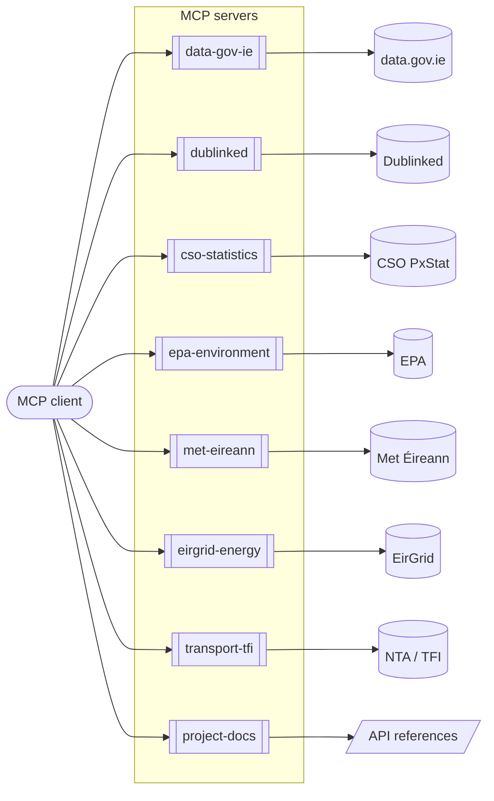

# Build for Ireland MCP

Small, read-only MCP servers for Irish public data. An MCP client can query eight servers directly: dataset catalogues, official statistics, water quality, weather, electricity, and public transport. Each data provider also has an API reference under `docs/apis/`.

## How it fits together

Connect an [MCP client](docs/mcp-guide.md#run-locally), then ask a question; the client picks the server.

| Server | What you can ask it | Source reference |
| --- | --- | --- |
| [`data-gov-ie`](docs/mcp-guide.md#available-now-data-gov-ie) | Search the national dataset catalogue | [data.gov.ie](docs/apis/data-gov-ie.md) |
| [`dublinked`](docs/mcp-guide.md#available-now-dublinked) | Search Dublin datasets and read their rows | [Dublinked](docs/apis/dublinked.md) |
| [`cso-statistics`](docs/mcp-guide.md#available-now-cso-statistics) | Find statistical tables and read values | [CSO PxStat](docs/apis/cso-pxstat.md) |
| [`epa-environment`](docs/mcp-guide.md#available-now-epa-environment) | River and lake status, bathing water quality and alerts | [EPA](docs/apis/epa.md) |
| [`met-eireann`](docs/mcp-guide.md#available-now-met-eireann) | Forecasts, warnings, and latest observations | [Met Éireann](docs/apis/met-eireann.md) |
| [`eirgrid-energy`](docs/mcp-guide.md#available-now-eirgrid-energy) | Electricity demand, wind, solar, CO2 (unofficial endpoint) | [EirGrid](docs/apis/eirgrid.md) |
| [`transport-tfi`](docs/mcp-guide.md#available-now-transport-tfi) | Timetable files; live bus data with an API key | [NTA / TFI](docs/apis/nta-tfi.md) |
| [`project-docs`](docs/mcp-guide.md#available-now-project-docs) | Read and search this repository's guides and API references | [docs/apis](docs/apis) |

An [interactive map of the API references](docs/diagrams/usage-map.html), where clicking a box opens its document, works from a local clone or GitHub Pages.

## Documentation

- [MCP guide](docs/mcp-guide.md) — every server's tools, inputs, and example questions.
- [MCP release plan](docs/mcp-release-plan.md) — connector sequence and release goals.
- API references under `docs/apis/` — endpoints, authentication, datasets, licence, limits, and gotchas for each data provider, linked in the table above.
- [Repository Guidelines](AGENTS.md) — contribution and development conventions.

## MCP servers

Run any server with its script: `npm run dev` (data-gov-ie), `npm run dev:project-docs`, `npm run dev:dublinked`, `npm run dev:cso`, `npm run dev:epa`, `npm run dev:met`, `npm run dev:eirgrid`, or `npm run dev:tfi`. `.mcp.json` registers all eight for clients that read it.

All use stdio and are read-only. Seven need no credentials. `transport-tfi` needs `NTA_API_KEY` for its two live tools only; see `.env.example`. `eirgrid-energy` uses the endpoint behind EirGrid's dashboard, which is not a documented API. See the [MCP guide](docs/mcp-guide.md) for every tool and the [release plan](docs/mcp-release-plan.md) for scope and limits.
